# Lab 2 — Containerization & Kubernetes Orchestration

## 1. Objective
To containerize an existing application using Docker, build an optimized container image, deploy and manage workloads within a local Kubernetes orchestration cluster, and evaluate horizontal scaling behavior and pod reconciliation across multiple replica states.

## 2. Existing Application
The project repository contains core Python source code:
- `app.py`: Standard output logic printing `Hello DevOps`.
- `login.py`: Authentication stub module (`def login(): pass`).

To allow the container to run as a managed Kubernetes workload without immediately exiting (which causes `CrashLoopBackOff`), an orchestration entrypoint (`entrypoint.py`) was introduced. It loads `app.py` and `login.py` while providing continuous lifecycle health checks and pod identification.

## 3. Environment
- **Host Operating System:** Windows 11
- **Container Engine:** Docker Desktop 4.82.0 (Docker Engine v29.6.1)
- **Container Runtime:** containerd v2.2.5 / runc v1.3.6
- **Kubernetes Version:** v1.36.1 (Docker Desktop Single-Node Cluster `desktop-control-plane`)
- **Kubernetes CLI (kubectl):** v1.36.1

## 4. Architecture
The architecture comprises a three-tier lifecycle:
```
Source Code (app.py, login.py, entrypoint.py)
       ↓
Dockerfile (python:3.11-slim Base Image)
       ↓
Docker Image (lab2-devops-app:latest)
       ↓
Kubernetes Deployment (lab2-deployment)
       ↓
ReplicaSet Controller (Dynamic Pod Reconciliation)
       ↓
Multiple Pods (lab2-deployment-5d66ff9d8d-*)
       ↓
Kubernetes Service (lab2-service: ClusterIP on Port 80)
```

## 5. Docker Containerization
The application was packaged into an immutable container image using `python:3.11-slim` as the minimal base image. The container copies the application source code and runs unbuffered Python output for instant container logging.

## 6. Dockerfile
Location: `lab2-orchestration/docker/Dockerfile`

```dockerfile
# Base image
FROM python:3.11-slim

# Set working directory
WORKDIR /app

# Set environment variables for unbuffered output
ENV PYTHONUNBUFFERED=1

# Copy original application files
COPY app.py .
COPY login.py .

# Copy orchestration runner
COPY lab2-orchestration/docker/entrypoint.py .

# Run entrypoint
CMD ["python", "-u", "entrypoint.py"]
```

Build context exclusion (`.dockerignore`):
```
.git
.gitignore
lab2/
lab2-bind/
lab2-evidence-raw/
lab2-orchestration/
__pycache__/
*.pdf
*.zip
```

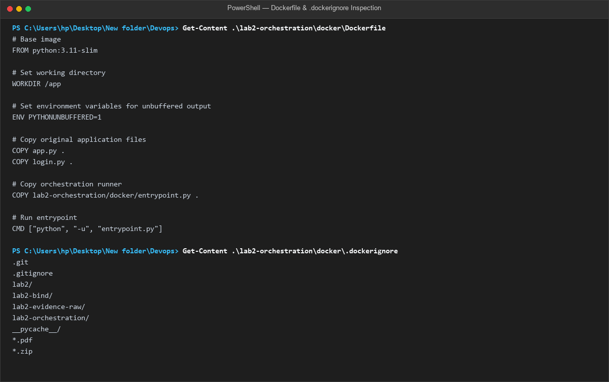

## 7. Docker Image
The image was built using Docker BuildKit:
```powershell
docker build -t lab2-devops-app:latest -f .\lab2-orchestration\docker\Dockerfile .
```
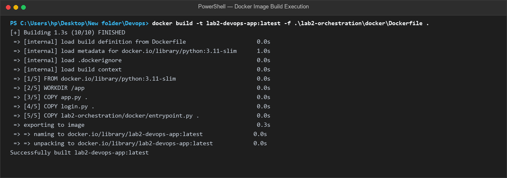

Image verification:
```powershell
docker images lab2-devops-app:latest
```
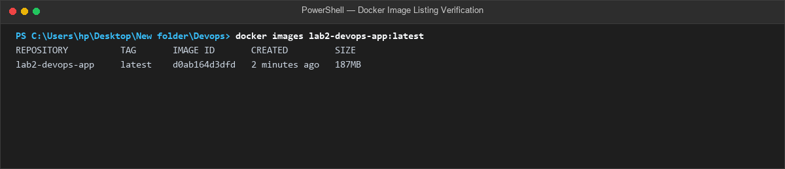

## 8. Container Execution
A test container was run locally to verify execution:
```powershell
docker run -d --name lab2-container-test lab2-devops-app:latest
docker ps --filter "name=lab2-container-test"
docker logs lab2-container-test
docker rm -f lab2-container-test
```
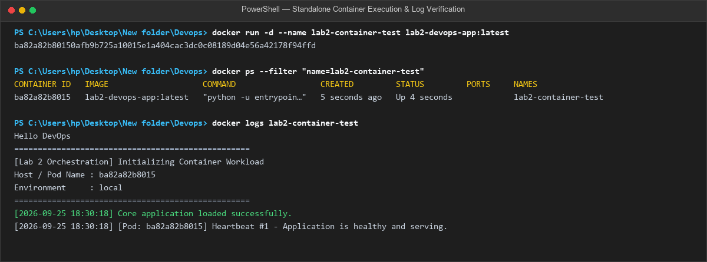

## 9. Kubernetes Environment
Cluster status was verified using `kubectl`:
```powershell
kubectl version --client
kubectl cluster-info
kubectl get nodes
```
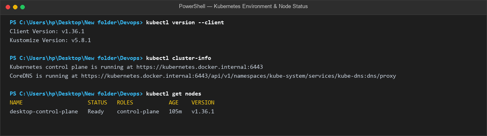

## 10. Kubernetes Deployment
A declarative Kubernetes Deployment manifest (`deployment.yaml`) was created and applied:
- **Deployment Name:** `lab2-deployment`
- **Replicas:** 1 (initial baseline)
- **Image:** `lab2-devops-app:latest` (`imagePullPolicy: IfNotPresent`)
- **Resource Limits:** CPU `250m`, Memory `128Mi`
- **Resource Requests:** CPU `100m`, Memory `64Mi`

```powershell
kubectl apply -f .\lab2-orchestration\kubernetes\deployment.yaml
kubectl get deployments -o wide
kubectl get pods -l app=lab2-app -o wide
```
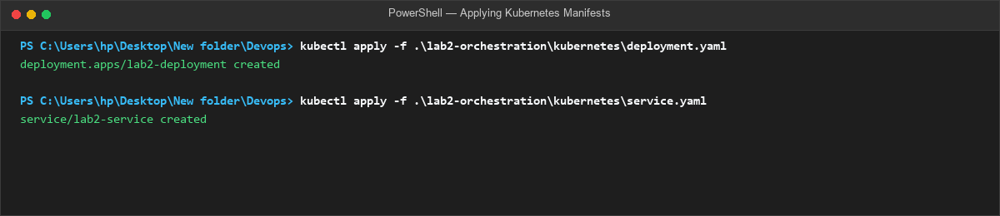
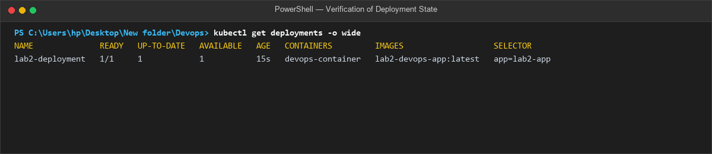
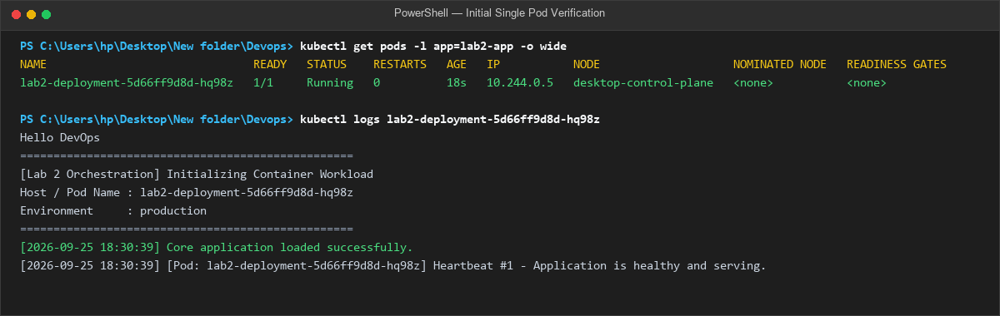

## 11. Kubernetes Service
A `ClusterIP` Service (`service.yaml`) was created to provide a stable internal virtual IP and DNS endpoint for the workload:
```powershell
kubectl apply -f .\lab2-orchestration\kubernetes\service.yaml
kubectl get services lab2-service
kubectl describe service lab2-service
```
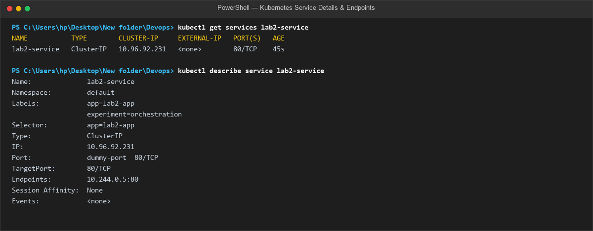

## 12. Scaling Strategy
Kubernetes uses a declarative desired-state model. The Deployment controller monitors the active `ReplicaSet` and compares the actual pod count with `spec.replicas`. When the replica count is updated, the controller instantly schedules new pods or gracefully terminates existing pods until equilibrium is achieved.

## 13. Scaling Experiment
The scaling experiment was performed in two successive phases:

### Phase A: Baseline (1 Replica)
- Verified initial single pod: `lab2-deployment-5d66ff9d8d-hq98z` (Running, 1/1 Ready).
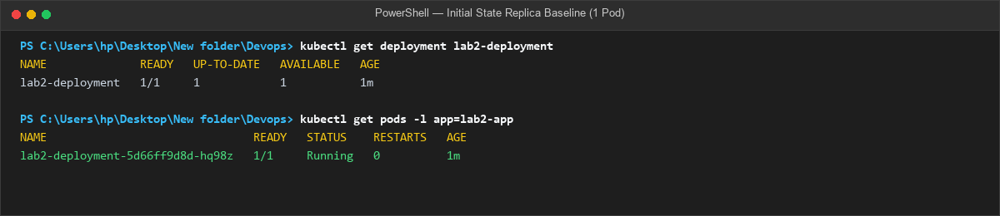

### Phase B: Scaling to 3 Replicas
Command:
```powershell
kubectl scale deployment lab2-deployment --replicas=3
```
- Deployment controller created 2 additional pods: `48zzf` and `xt9xn`.
- All 3 pods reached `Running` status on node `desktop-control-plane`.
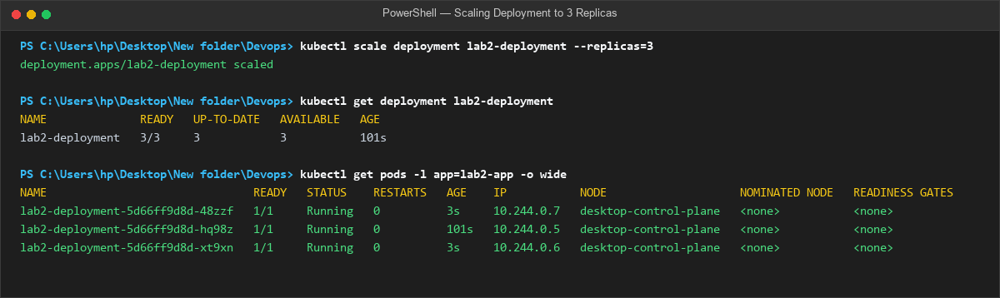

### Phase C: Scaling to 5 Replicas
Command:
```powershell
kubectl scale deployment lab2-deployment --replicas=5
```
- Deployment controller created 2 more pods: `5gp6l` and `klzt2`.
- Total running pods reconciled to 5/5.
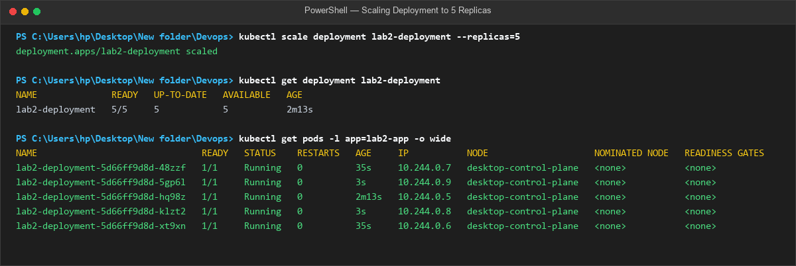

## 14. Scaling Results

| Metric | Initial State | Scale Step 1 | Scale Step 2 |
| :--- | :--- | :--- | :--- |
| **Target Replicas** | 1 | 3 | 5 |
| **Ready Replicas** | 1 | 3 | 5 |
| **Available Replicas** | 1 | 3 | 5 |
| **Running Pod Names** | `...-hq98z` | `...-hq98z`<br>`...-48zzf`<br>`...-xt9xn` | `...-hq98z`<br>`...-48zzf`<br>`...-xt9xn`<br>`...-5gp6l`<br>`...-klzt2` |
| **Assigned Pod IPs** | 10.244.0.5 | 10.244.0.5, 10.244.0.7, 10.244.0.6 | 10.244.0.5, 10.244.0.7, 10.244.0.6, 10.244.0.9, 10.244.0.8 |
| **Reconciliation Time** | < 3s | ~ 3s | ~ 3s |
| **Controller Event** | `Scaled up from 0 to 1` | `Scaled up from 1 to 3` | `Scaled up from 3 to 5` |

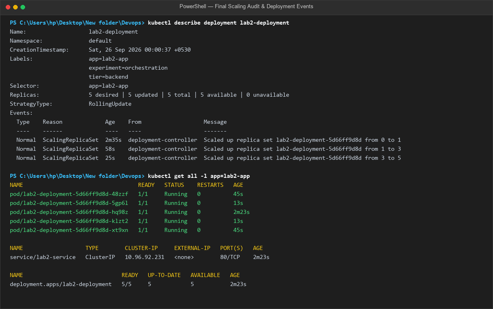

## 15. Observations
1. **Container Isolation & Portability:** The Python workload runs inside an isolated container environment without relying on host system Python libraries.
2. **Declarative State Management:** Kubernetes continuously compares desired vs current state. When `replicas=3` or `replicas=5` was set, the `deployment-controller` created new Pod objects within seconds.
3. **Internal IP Assignment:** Each pod received a unique cluster IP (`10.244.0.x`) managed by the Kubernetes CNI plugin.
4. **Service Discovery & Endpoints:** The `lab2-service` automatically aggregated all 5 running pods into its endpoint list without requiring manual network configuration.

## 16. Result
The containerization and orchestration experiment was executed successfully. The application was built into a Docker image, deployed via Kubernetes Deployment and Service, and scaled from 1 to 3 and 5 active running replicas with verified reconciliation.

## 17. Conclusion
Kubernetes orchestration provides automated lifecycle management, declarative scaling, and centralized service discovery. It abstracts container management, enabling reliable scaling of workloads across clusters.

## 18. Evidence Mapping

| Requirement | Screenshot File | Verification Details |
| :--- | :--- | :--- |
| Repository Inspection | `01-repository-inspection.png` | Source files and previous Lab 2 artifacts preserved |
| Dockerfile & .dockerignore | `02-dockerfile.png` | Manifest contents and ignore rules verified |
| Docker Image Build | `03-docker-build-success.png` | Image built with 10/10 layers finished |
| Docker Image Listing | `04-docker-image.png` | Image `lab2-devops-app:latest` confirmed |
| Container Execution | `05-docker-container-running.png` | Standalone container running with valid logs |
| Kubernetes Environment | `06-kubernetes-environment.png` | Control plane node `desktop-control-plane` Ready |
| Deployment & Service Applied | `07-deployment-applied.png` | Deployment and Service objects created |
| Deployment Verification | `08-kubectl-get-deployments.png` | Deployment state verified (1/1 Ready) |
| Pod Verification | `09-kubectl-get-pods.png` | Pod running and logs emitting heartbeats |
| Service Details | `10-kubernetes-service.png` | ClusterIP service routing to pod endpoints |
| Baseline Replicas | `11-initial-replicas.png` | Single replica baseline confirmed |
| Scale to 3 Replicas | `12-scaled-to-3-replicas.png` | 3/3 pods running across cluster |
| Scale to 5 Replicas | `13-scaled-to-5-replicas.png` | 5/5 pods running across cluster |
| Final Audit & Events | `14-final-pods.png` | All resources and replica events verified |
