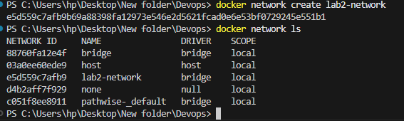
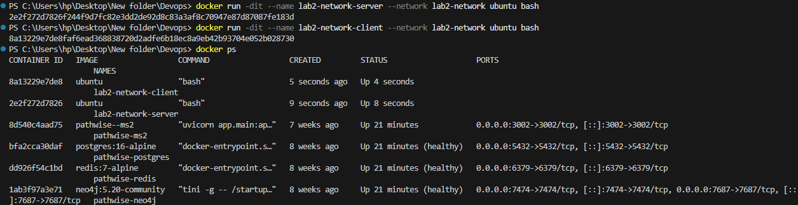
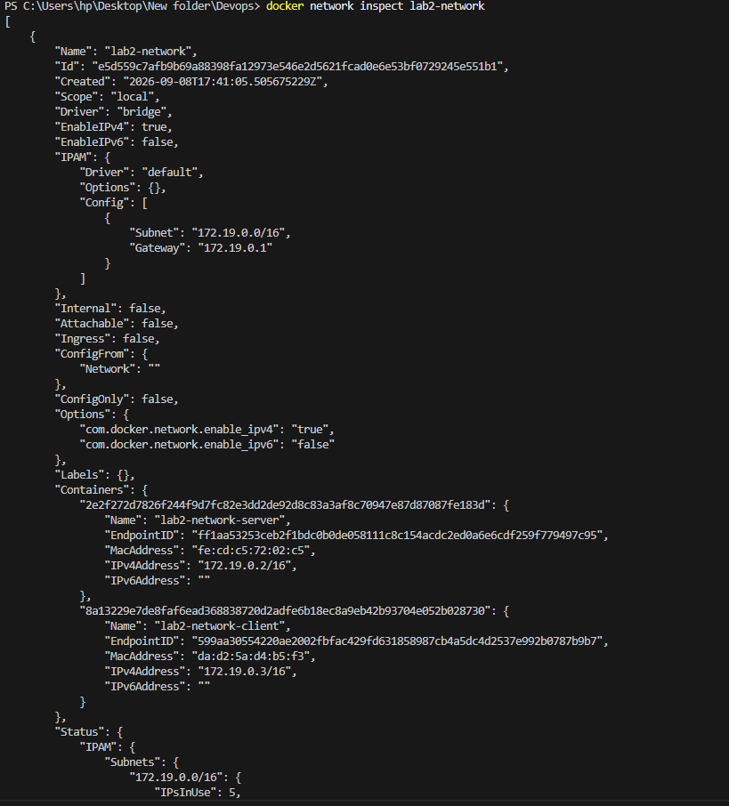
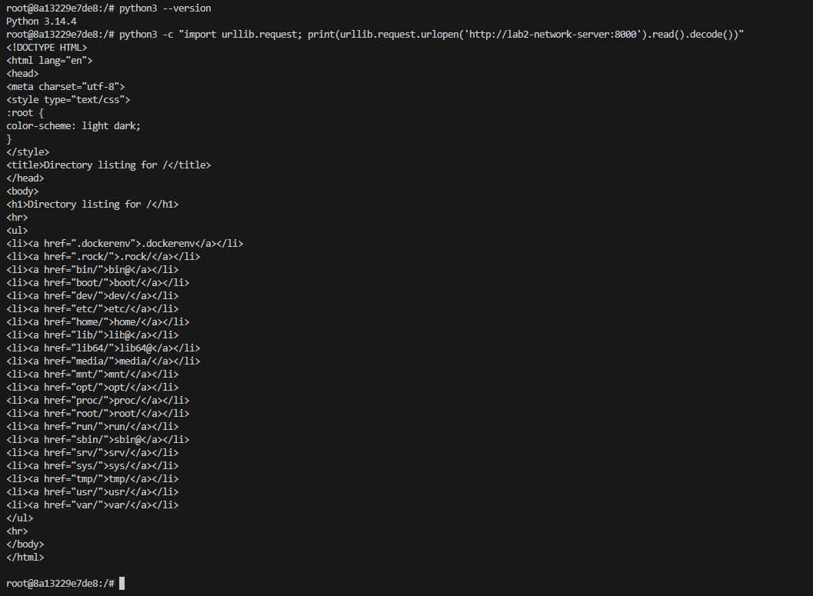
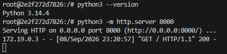

# Lab 2 - Docker Network

## Objective
To demonstrate Docker network creation, network inspection, and container-to-container communication using container names and IP addresses.

## Environment
- **Docker version:** 29.6.1
- **Host OS:** Windows

## 1. Creating the Docker Network
A custom bridge network was created to allow isolated container communication.
```bash
docker network create lab2-network
docker network ls
```


## 2. Creating Containers
Two containers were started and attached to the `lab2-network`:
```bash
docker run -dit --name lab2-network-server --network lab2-network ubuntu bash
docker run -dit --name lab2-network-client --network lab2-network ubuntu bash
docker ps
```


## 3. Network Inspection
The custom network was inspected to verify the configuration and connected containers.
```bash
docker network inspect lab2-network
```


From the inspection:
- **Network:** lab2-network
- **Driver:** bridge
- **Subnet:** 172.19.0.0/16
- **Gateway:** 172.19.0.1
- **Server (`lab2-network-server`):** 172.19.0.2
- **Client (`lab2-network-client`):** 172.19.0.3

## 4. Container Names and IP Addresses

| Container Name | IP Address |
| --- | --- |
| lab2-network-server | 172.19.0.2 |
| lab2-network-client | 172.19.0.3 |

## 5. Container-to-Container Communication
Inside the `lab2-network-server` container, a Python HTTP server was started:
```bash
python3 -m http.server 8000
```

Inside the `lab2-network-client` container, communication with the server was established using the container name `lab2-network-server` (resolved by Docker internal DNS):
```bash
python3 -c "import urllib.request; print(urllib.request.urlopen('http://lab2-network-server:8000').read().decode())"
```
The client successfully received the HTTP directory listing response.


The server logged the incoming HTTP request from the client's IP (`172.19.0.3`):


## Observation
- Containers attached to the same custom Docker network can communicate with each other.
- Docker's built-in DNS resolves container names to their internal IP addresses, enabling name-based communication.

## Result
The Docker network experiment was successful. Container-to-container communication was verified using a custom bridge network and container names.

## Conclusion
Custom Docker networks provide secure, isolated communication channels between containers, removing the need to link containers manually or expose ports to the host system.
