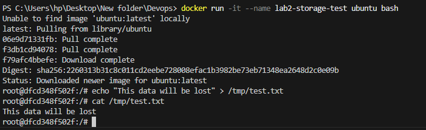
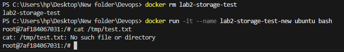
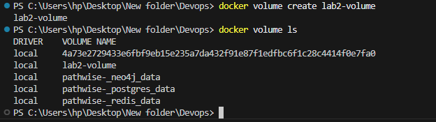
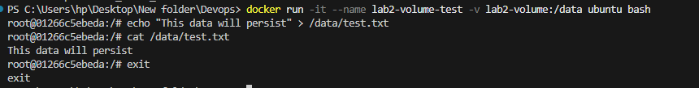
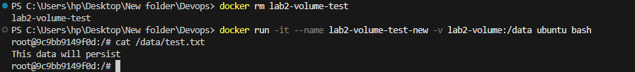
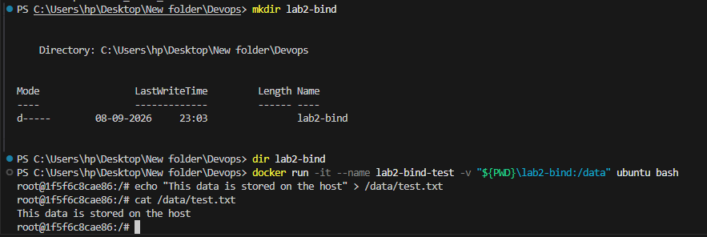
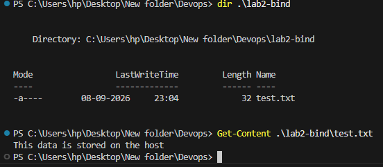
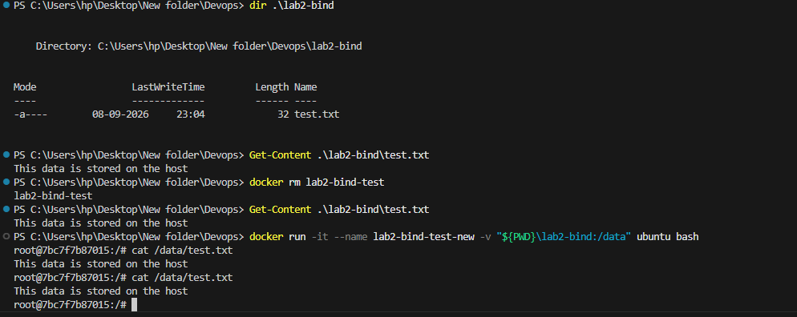

# Lab 2 - Docker Storage

## Objective
To demonstrate Docker storage mechanisms, specifically focusing on container layer data loss, named volume persistence, and bind mount persistence.

## Environment
- **Docker version:** 29.6.1
- **Host OS:** Windows

## 1. Container Layer Data Loss
A container's writable layer is temporary. If a container is removed, the data stored in this layer is lost. 

First, we create a file in the container layer:
```bash
docker run -it --name lab2-storage-test ubuntu bash
echo "This data will be lost" > /tmp/test.txt
cat /tmp/test.txt
```


After verifying the data, the container is deleted, and a new container is started. The file no longer exists, proving data loss.
```bash
docker rm lab2-storage-test
docker run -it --name lab2-storage-test-new ubuntu bash
cat /tmp/test.txt
```


## 2. Named Volume Persistence
Named volumes are managed by Docker and persist even after the container is deleted.

We first create a named volume called `lab2-volume`:
```bash
docker volume create lab2-volume
docker volume ls
```


We run a container mounting this volume to `/data` and write to a file:
```bash
docker run -it --name lab2-volume-test -v lab2-volume:/data ubuntu bash
echo "This data will persist" > /data/test.txt
cat /data/test.txt
```


After deleting the original container, we start a new one and mount the same volume. The data is still there:
```bash
docker rm lab2-volume-test
docker run -it --name lab2-volume-test-new -v lab2-volume:/data ubuntu bash
cat /data/test.txt
```


## 3. Bind Mount Persistence
Bind mounts attach a specific path on the host to a path inside the container. 

A host directory `lab2-bind` was mounted to the container. A file was created inside the container:
```bash
mkdir lab2-bind
docker run -it --name lab2-bind-test -v "${PWD}\lab2-bind:/data" ubuntu bash
echo "This data is stored on the host" > /data/test.txt
cat /data/test.txt
```


The file was successfully verified on the Windows host:
```powershell
dir .\lab2-bind
Get-Content .\lab2-bind\test.txt
```


After deleting the container, the host file remained intact. Starting a new container with the same bind mount showed the persisted data:
```bash
docker rm lab2-bind-test
docker run -it --name lab2-bind-test-new -v "${PWD}\lab2-bind:/data" ubuntu bash
cat /data/test.txt
```


## Observation
- The writable container layer is ephemeral.
- Named volumes and bind mounts retain data beyond the lifecycle of any single container.

## Result
The Docker storage experiment was successful. The difference between container layers, named volumes, and bind mounts has been demonstrated effectively.

## Conclusion
For permanent storage or data sharing between containers/host, Docker volumes and bind mounts must be used instead of the default container layer.
